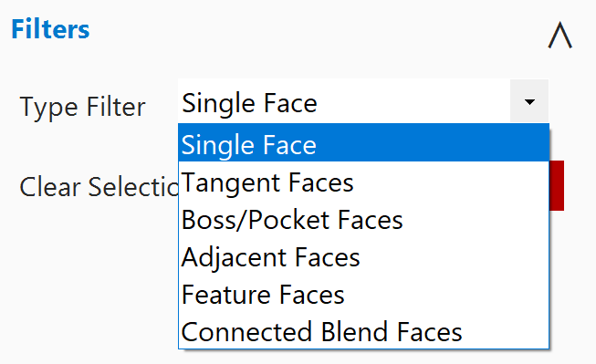
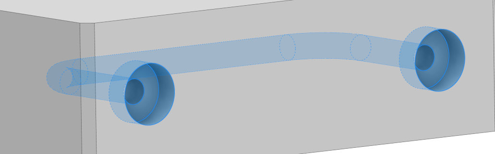

# CaseSelection Add-in for Autodesk Inventor

A **Smart Selection** tool that brings NX-style selection intent (Boss/Pocket, Tangency, Feature Faces) into Autodesk Inventor 2022-2026.

<p align="center">
  
</p>

<p align="center">
  
  
</p>

## Features

### Topology-Based Selection Filters

- **Single Face**  Standard single face selection
- **Tangent Faces**  Recursively selects all connected faces that are tangent (smooth transitions) via BFS
- **Boss/Pocket Faces**  Selects faces connected by concave or convex edges, identifying pocket and boss features
- **Adjacent Faces**  Selects all faces sharing an edge with the seed face
- **Feature Faces**  Selects all faces created by the same feature as the seed face
- **Connected Blend Faces**  Selects connected fillet/chamfer faces

### Selection Capabilities

- **Additive Selection**  Click multiple faces to build up a selection
- **Shift+Click Deselection**  Hold Shift and click to remove faces/groups from the selection
- **Select All**  Select all visible faces in the document
- **Invert Selection**  Toggle between selected and unselected faces
- **Find Similar**  Find faces with similar geometry properties to a template face
- **Color Search**  Pick a color and find faces that match it

### Visual Feedback

- **Blue Highlight**  Selected faces
- **Orange Highlight**  Template faces for "Find Similar"
- **Green Highlight**  Preview/hover feedback

### Keyboard Shortcuts

- **Ctrl+J**  Open/toggle the Class Selection dialog
- **Escape**  Close the dialog

## Requirements

- Autodesk Inventor 2022, 2023, 2024, 2025, or 2026
- .NET SDK 8.0 or later (for building from source)
- Windows 10/11 x64

## Installation

### Quick Install

1. Double-click `Install.bat` to build and install the add-in
2. Restart Inventor

### PowerShell Install

```powershell
.\Install-CaseSelection.ps1
```

#### Options

- `-InstallScope User` (default) or `-InstallScope Machine`
- `-Configuration Release` (default) or `-Configuration Debug`
- `-SkipBuild` to skip the build step

The installer automatically detects installed Inventor versions and deploys the correct build (net48 for 2022-2024, net8.0-windows for 2025-2026).

### Manual Installation

1. Build the project:
   ```powershell
   dotnet build -c Release
   ```
2. Copy `CaseSelection.dll` and `CaseSelection.addin` to:
   - **User:** `%APPDATA%\Autodesk\Inventor <version>\Addins\CaseSelection\`
   - **Machine:** `C:\ProgramData\Autodesk\Inventor Addins\CaseSelection\`

   Use the `net48` build output for Inventor 2022-2024, and `net8.0-windows` for 2025-2026.

## Uninstallation

- Double-click `Uninstall.bat`
- Or run: `.\Uninstall-CaseSelection.ps1`

## Usage

1. Open a Part or Assembly document in Inventor
2. Navigate to the **Power Tools** tab on the ribbon
3. Click the **Class Selection** button to open the floating dialog
4. Select a filter type from the dropdown
5. Click faces to select (Shift+Click to deselect)
6. Use **Done** to commit the selection to Inventor's native selection, or **Cancel** to clear

## Project Structure

```
CaseSelection/
+-- StandardAddInServer.cs              # Main add-in entry point & ribbon integration
+-- CaseSelection.addin                 # Inventor add-in manifest
+-- CaseSelection.csproj                # Multi-target: net48 + net8.0-windows
+-- Core/
|   +-- SelectionFilterType.cs          # Filter type enumeration
|   +-- SelectionManager.cs             # Core selection logic & InteractionEvents
|   +-- TopologyAnalyzer.cs             # Topology algorithms (Boss/Pocket, Tangent, etc.)
|   +-- HighlightManager.cs            # Visual highlight feedback management
+-- UI/
|   +-- ClassSelectionForm.cs           # Floating dialog code-behind
|   +-- ClassSelectionForm.Designer.cs  # Form designer layout
|   +-- ClassSelectionControl.cs        # Dockable panel control (alternative UI)
+-- Properties/
|   +-- AssemblyInfo.cs                 # Assembly metadata & GUID
+-- Install-CaseSelection.ps1          # PowerShell installer
+-- Uninstall-CaseSelection.ps1        # PowerShell uninstaller
+-- Install.bat                         # Batch installer wrapper
+-- Uninstall.bat                       # Batch uninstaller wrapper
+-- README.md
```

## Building from Source

```powershell
cd CaseSelection
dotnet build -c Release
# Outputs: bin\Release\net48\ and bin\Release\net8.0-windows\
```

## Technical Details

### Topology Algorithms

- **Tangent Faces**  BFS from the seed face, following edges where adjacent face normals have a dot product > 0.99 (nearly parallel). Stops at sharp edges.
- **Boss/Pocket Faces**  BFS traversal following concave or convex edges. Concavity is determined by face normal directions at the edge and edge direction relative to face centers.

### InteractionEvents

- `OnPreSelect`  Lightweight check; only verifies the object is a Face
- `OnSelect`  Full topology logic runs here
- Uses `HighlightSet` for solid face highlighting

## License

This project is licensed under the MIT License. See the [LICENSE](../LICENSE) file for details.
