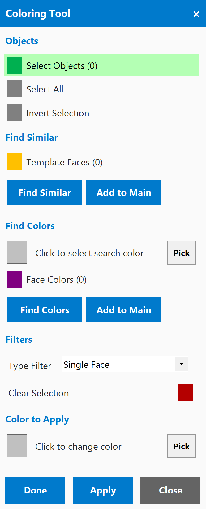

# Coloring Tool Add-in for Autodesk Inventor

A face coloring tool for Autodesk Inventor 2022-2026 that lets you select faces using intelligent topology-based filters and apply any color to them using Inventor's appearance system.

<p align="center">
  
</p>

<p align="center">
  
</p>

## Features

### Smart Face Selection

Select faces using topology-based filters:
- **Single Face**  Select individual faces
- **Tangent Faces**  Select smoothly connected face chains
- **Boss/Pocket Faces**  Select faces forming boss or pocket features
- **Adjacent Faces**  Select all faces sharing an edge with the seed face
- **Feature Faces**  Select all faces from the same feature
- **Connected Blend Faces**  Select connected fillet/chamfer faces

### Selection Operations

- **Select All**  Select all visible faces in the document
- **Invert Selection**  Toggle selected and unselected faces
- **Find Similar**  Find faces with similar geometry to a template
- **Find by Color**  Search for faces matching a specific color
- **Pick Color from Face**  Eyedropper tool to sample a face's color
- **Shift+Click**  Deselect faces

### Color Application

- **Windows Color Dialog**  Choose any color via the standard color picker, or pick a color from an existing face
- **Done**  Apply the selected color to faces and close the tool
- **Apply**  Apply the selected color and keep the tool open for more changes
- **Close**  Close the tool without applying

### Keyboard Shortcuts

- **Ctrl+K**  Open the Coloring Tool dialog
- **Escape**  Clear selection (first press) or close dialog (second press)

## Requirements

- Autodesk Inventor 2022, 2023, 2024, 2025, or 2026
- .NET SDK 8.0 or later (for building from source)
- Windows 10/11 x64

## Installation

### Quick Install

1. Double-click `Install.bat`
2. Restart Inventor

### PowerShell Install

```powershell
.\Install-ColoringTool.ps1
```

#### Options

- `-InstallScope User` (default) or `-InstallScope Machine`
- `-Configuration Release` (default) or `-Configuration Debug`
- `-SkipBuild` to skip the build step

The installer automatically detects installed Inventor versions and deploys the correct build (net48 for 2022-2024, net8.0-windows for 2025-2026).

### Manual Installation

1. Build the project:
   ```powershell
   dotnet build -c Release
   ```
2. Copy `ColoringTool.dll` and `ColoringTool.addin` to:
   - **User:** `%APPDATA%\Autodesk\Inventor <version>\Addins\ColoringTool\`
   - **Machine:** `C:\ProgramData\Autodesk\Inventor Addins\ColoringTool\`

   Use the `net48` build output for Inventor 2022-2024, and `net8.0-windows` for 2025-2026.

## Uninstallation

- Double-click `Uninstall.bat`
- Or run: `.\Uninstall-ColoringTool.ps1`

## Usage

1. Open a Part or Assembly document in Inventor
2. Navigate to the **Power Tools** tab on the ribbon
3. Click the **Coloring Tool** button
4. Select faces using the filter dropdown
5. Choose a color by clicking the color swatch (opens Windows Color Dialog) or use **Pick** to sample from a face
6. Click **Apply** to color the selected faces, or **Done** to apply and close

## Project Structure

```
ColoringTool/
+-- StandardAddInServer.cs              # Main add-in entry point & ribbon integration
+-- ColoringTool.addin                  # Inventor add-in manifest
+-- ColoringTool.csproj                 # Multi-target: net48 + net8.0-windows
+-- Core/
|   +-- SelectionFilterType.cs          # Selection filter enumeration
|   +-- SelectionManager.cs             # Selection logic & color application
|   +-- TopologyAnalyzer.cs             # Topology analysis algorithms
+-- UI/
|   +-- ColoringToolForm.cs             # Form code-behind
|   +-- ColoringToolForm.Designer.cs    # Form UI layout
+-- Properties/
|   +-- AssemblyInfo.cs                 # Assembly metadata & GUID
+-- Install-ColoringTool.ps1            # PowerShell installer
+-- Uninstall-ColoringTool.ps1          # PowerShell uninstaller
+-- Install.bat                         # Batch installer wrapper
+-- Uninstall.bat                       # Batch uninstaller wrapper
+-- README.md
```

## Building from Source

```powershell
cd ColoringTool
dotnet build -c Release
# Outputs: bin\Release\net48\ and bin\Release\net8.0-windows\
```

## License

This project is licensed under the MIT License. See the [LICENSE](../LICENSE) file for details.
