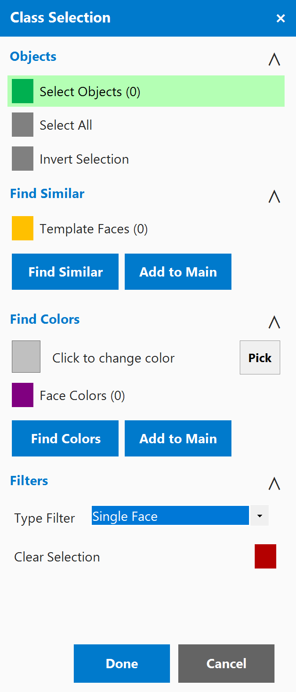
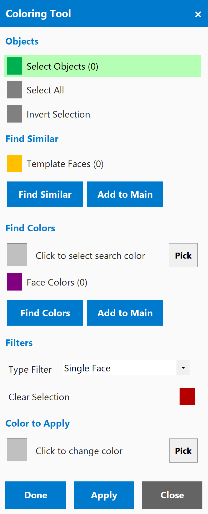
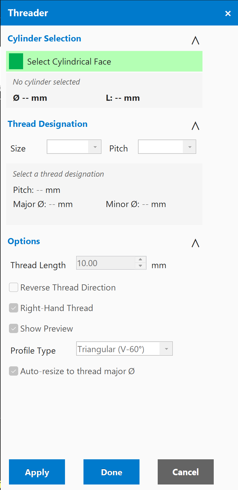
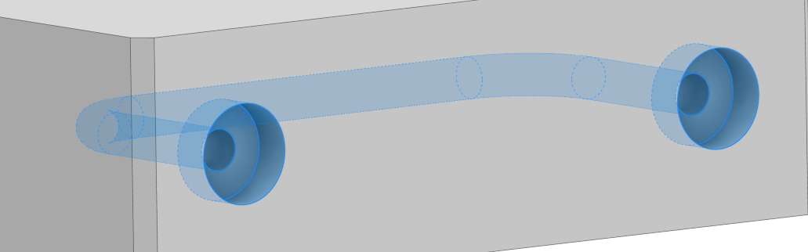
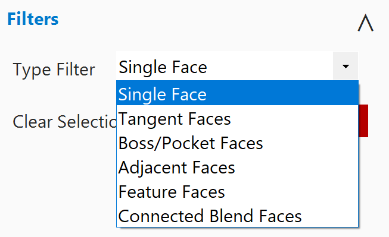

# Power Tools for Autodesk Inventor 2026

[](LICENSE)
[](https://www.autodesk.com/products/inventor)
[](https://dotnet.microsoft.com/)
[](https://github.com/ardenkg/inventor-power-tools/releases)

> Missing NX's smart selection in Inventor? This addon brings tangent face selection, boss/pocket filtering, and more.

NX-style topology selection, face coloring, and physical thread generation for Autodesk Inventor. All tools live under the **Power Tools** tab in Inventor's ribbon.

<p align="center">
  
  
  
</p>

<p align="center">
  
  
</p>

<p align="center">
  
</p>

## Add-ins

| Add-in | Description |
|--------|-------------|
| [CaseSelection](CaseSelection/) | NX-style smart face selection with topology filters (tangent, boss/pocket, feature, blend) |
| [ColoringTool](ColoringTool/) | Select faces with topology filters and apply any color via Inventor's appearance system |
| [Threader](Threader/) | Generate physical helical thread geometry from cylindrical faces using ISO Metric standards |

## Quick Start

### Install All Add-ins

Double-click **`Install-All.bat`** or run:

```powershell
.\Install-All.ps1
```

This builds all three projects and copies them to your Inventor Add-ins folder. Restart Inventor after installing.

### Install a Single Add-in

Each add-in can be installed independently:

```powershell
# Example: install only CaseSelection
.\CaseSelection\Install-CaseSelection.ps1
```

Or double-click the `Install.bat` inside any add-in folder.

### Uninstall

```powershell
.\Uninstall-All.ps1          # Remove all
.\CaseSelection\Uninstall-CaseSelection.ps1   # Remove one
```

## Requirements

- **Autodesk Inventor 2026**
- **.NET SDK 8.0** or later (for building from source)
- **Windows 10/11** x64

## Usage

1. Open a Part or Assembly document in Inventor
2. Go to the **Power Tools** tab on the ribbon
3. Each add-in has its own panel with a button to launch it

### Keyboard Shortcuts

| Shortcut | Tool |
|----------|------|
| `Ctrl+J` | CaseSelection |
| `Ctrl+K` | ColoringTool |
| `Ctrl+L` | Threader |

## Building from Source

```powershell
# Build all
dotnet build CaseSelection\CaseSelection.csproj -c Release
dotnet build ColoringTool\ColoringTool.csproj -c Release
dotnet build Threader\Threader.csproj -c Release
```

Each project references the Inventor 2026 interop assembly at:
`C:\Program Files\Autodesk\Inventor 2026\Bin\Public Assemblies\Autodesk.Inventor.Interop.dll`

## Project Structure

```
Inventor-Addins/
├── Install-All.bat / .ps1          # Install all add-ins at once
├── Uninstall-All.bat / .ps1        # Uninstall all add-ins
├── CaseSelection/                  # Smart face selection tool
│   ├── Core/                       # Selection logic & topology algorithms
│   ├── UI/                         # WinForms floating dialog
│   └── ...
├── ColoringTool/                   # Face coloring tool
│   ├── Core/                       # Selection & color application logic
│   ├── UI/                         # WinForms dialog with color picker
│   └── ...
└── Threader/                       # Physical thread generator
    ├── Core/                       # Cylinder analysis & thread generation
    ├── UI/                         # WinForms dialog with thread options
    └── ...
```

## License

This project is licensed under the [MIT License](LICENSE).
