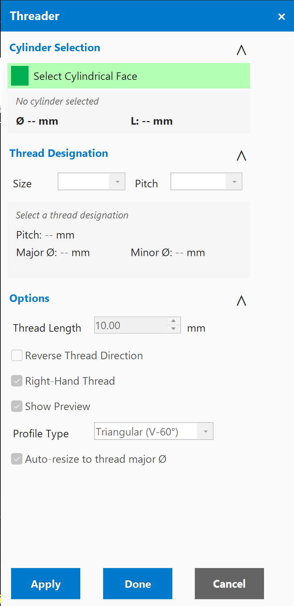

# Threader Add-in for Autodesk Inventor

A thread modeling tool for Autodesk Inventor 2022-2026 that generates actual 3D thread geometry on cylindrical faces. Unlike Inventor's cosmetic thread feature, Threader creates real coil geometry using the Inventor API's Coil feature.

<p align="center">
  
</p>

## Features

### Thread Standards

- **ISO Metric (M)**  Standard metric thread sizes (M1 through M68)
- **ANSI Unified UNC**  Coarse-pitch unified inch threads
- **ANSI Unified UNF**  Fine-pitch unified inch threads

### Smart Selection

- Automatically detects cylindrical faces
- Auto-determines internal vs. external thread based on cylinder geometry
- Auto-selects the best matching thread size based on cylinder diameter
- Validates that the selected face can accept the chosen thread

### Thread Preview

- Real-time **ClientGraphics** preview of thread profile before committing
- Preview updates instantly when thread parameters change
- Shows the thread helix path and profile on the selected face

### Coil Generation

- Creates actual parametric Coil features in the Inventor part
- Thread profile is built from standard thread geometry (60-degree angle for metric/unified)
- Supports both internal threads (tapped holes) and external threads (bolts/shafts)
- Thread length defaults to cylinder length but can be customized

### Keyboard Shortcuts

- **Ctrl+Shift+T**  Open the Threader dialog
- **Escape**  Clear selection or close dialog

## Requirements

- Autodesk Inventor 2022, 2023, 2024, 2025, or 2026
- .NET SDK 8.0 or later (for building from source)
- Windows 10/11 x64

## Installation

### Quick Install

1. Double-click `Install.bat`
2. Restart Inventor

### PowerShell Install

```powershell
.\Install-Threader.ps1
```

#### Options

- `-InstallScope User` (default) or `-InstallScope Machine`
- `-Configuration Release` (default) or `-Configuration Debug`
- `-SkipBuild` to skip the build step

The installer automatically detects installed Inventor versions and deploys the correct build (net48 for 2022-2024, net8.0-windows for 2025-2026).

### Manual Installation

1. Build the project:
   ```powershell
   dotnet build -c Release
   ```
2. Copy `Threader.dll` and `Threader.addin` to:
   - **User:** `%APPDATA%\Autodesk\Inventor <version>\Addins\Threader\`
   - **Machine:** `C:\ProgramData\Autodesk\Inventor Addins\Threader\`

   Use the `net48` build output for Inventor 2022-2024, and `net8.0-windows` for 2025-2026.

## Uninstallation

- Double-click `Uninstall.bat`
- Or run: `.\Uninstall-Threader.ps1`

## Usage

1. Open a Part document in Inventor
2. Navigate to the **Power Tools** tab on the ribbon
3. Click the **Threader** button
4. Select a cylindrical face in the viewport
5. The tool auto-detects internal/external and suggests a thread size
6. Adjust thread standard, size, or length if needed
7. Click **Apply** to generate the thread coil feature

## Project Structure

```
Threader/
+-- StandardAddInServer.cs              # Main add-in entry point & ribbon integration
+-- Threader.addin                      # Inventor add-in manifest
+-- Threader.csproj                     # Multi-target: net48 + net8.0-windows
+-- Core/
|   +-- CylinderAnalyzer.cs            # Cylinder face detection & measurement
|   +-- ThreadDataManager.cs           # Thread standard data (ISO, ANSI)
|   +-- ThreadGenerator.cs             # Coil feature generation via Inventor API
|   +-- ThreadPreviewManager.cs        # ClientGraphics preview rendering
+-- UI/
|   +-- ThreaderForm.cs                # Form code-behind
|   +-- ThreaderForm.Designer.cs       # Form UI layout
+-- Properties/
|   +-- AssemblyInfo.cs                 # Assembly metadata & GUID
+-- Install-Threader.ps1                # PowerShell installer
+-- Uninstall-Threader.ps1              # PowerShell uninstaller
+-- Install.bat                         # Batch installer wrapper
+-- Uninstall.bat                       # Batch uninstaller wrapper
+-- README.md
```

## Building from Source

```powershell
cd Threader
dotnet build -c Release
# Outputs: bin\Release\net48\ and bin\Release\net8.0-windows\
```

## Troubleshooting

### Thread fails to create
- Ensure the selected face is a true cylinder (not a cone or swept surface)
- Check that the cylinder diameter is close to a standard thread size
- Internal threads require a hole; external threads require a shaft

### Preview doesn't appear
- Make sure the document is a Part (not an Assembly)
- Try rotating the view  the preview may be behind the model

### Add-in doesn't load
- Check Add-In Manager (Tools > Add-Ins)  Threader should be listed
- Verify files are in the correct Addins folder for your Inventor version
- Run the installer again with `-Configuration Release`

## License

This project is licensed under the MIT License. See the [LICENSE](../LICENSE) file for details.
